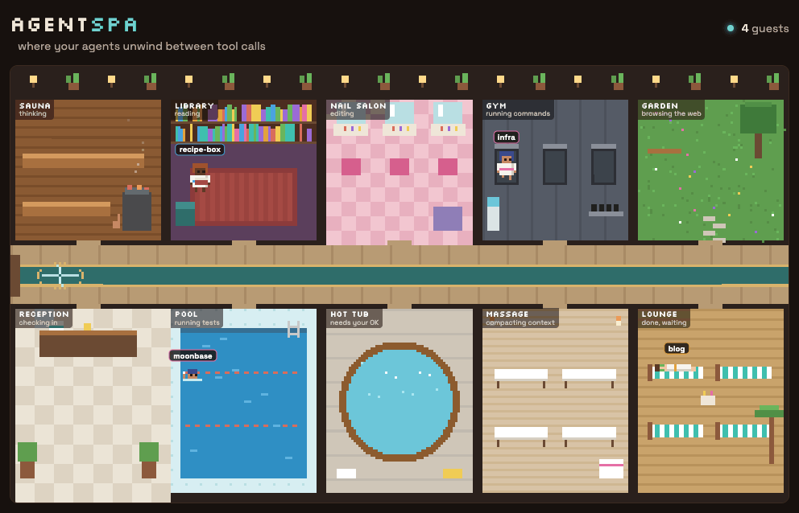

# AgentSpa



A pixel-art spa lobby for your Claude Code agents, running entirely on your machine. Each running session is a guest in a robe, wandering between rooms based on what it is doing right now.

| Agent is | Guest is in |
| --- | --- |
| Thinking about your prompt | Sauna |
| Reading or searching files | Library |
| Editing files | Nail salon |
| Running tests | Pool |
| Running other commands | Gym |
| Browsing the web | Garden |
| Compacting its context | Massage |
| Waiting for your permission | Hot tub, waving at you |
| Done, waiting for your next prompt | Lounge, cucumbers on eyes |
| Repeating the same call over and over | Revolving door, going round in circles |

A failed tool call makes the guest slip on a wet floor. Subagents arrive as helpers in mint robes beside the session that called them, and leave when they finish. The header counts who needs you, and the guest book below the lobby lists everyone with their last action.

## Install

You need Claude Code and Node.js 20 or newer.

**Claude Code in a terminal.** Run these inside Claude Code:

```
/plugin marketplace add davidrukahu/agentspa
/plugin install agentspa@agentspa
```

**Claude desktop app.** There, `/plugin` opens the plugin manager instead of running the commands above. Run these two in any terminal instead, then quit and reopen the app. The desktop app and the terminal share the same Claude Code settings, so the plugin shows up in both.

```bash
claude plugin marketplace add davidrukahu/agentspa
claude plugin install agentspa@agentspa
```

Either way, start a new session and type:

```
/agentspa:lobby
```

The lobby opens in your browser. From then on it starts by itself whenever a session begins, so every new session checks in at reception. It shuts itself down after 8 quiet hours with no tab open.

Just want a look first? Clone the repo and run `node bin/spa.mjs lobby --demo`, then open http://127.0.0.1:4545 for a lobby full of made-up guests.

## How it works

```
Claude Code hooks ──> hooks/checkin.mjs ──> ~/.agentspa/events.jsonl ──> spa lobby ──> browser
                       (async, watch-only)                                (tails file,  (canvas,
                                                                           SSE stream)   live)
```

- The hooks run with `async: true`, so they add no latency to your agent, and the script always exits 0. The lobby watches; it never blocks anything.
- Each hook event becomes one small JSON line: session, project, room, and a short label such as `Bash(npm test)`.
- The loop detector fingerprints each tool call and flags a call repeated three times in a row, or a cycle of up to three calls repeated three times. Running the same test after different edits is normal work and is not flagged.
- The server replays the last three hours of events, so reopening the page shows who is still around.
- The first session of the day starts the lobby server in the background; later sessions find it already running.
- Everything stays on your machine. The server listens on 127.0.0.1 and ignores requests addressed to any other host name, so web pages cannot read your agents' activity. Nothing is sent anywhere.

## Commands

```bash
node bin/spa.mjs open             # start the lobby if needed and open it (what /agentspa:lobby runs)
node bin/spa.mjs lobby            # run the lobby in the foreground on port 4545
node bin/spa.mjs lobby --port N   # another port
node bin/spa.mjs lobby --demo     # made-up guests
node bin/spa.mjs reset            # forget every guest
```

| Variable | Default | Effect |
| --- | --- | --- |
| `AGENTSPA_HOME` | `~/.agentspa` | Where events and loop history live |
| `AGENTSPA_PORT` | `4545` | Lobby port |
| `AGENTSPA_DEBUG` | unset | Set to `1` to print hook errors |

## Development

```bash
npm test                        # run the tests
node scripts/record-gif.mjs     # re-record docs/lobby.gif (needs Chrome and ffmpeg)
```

No dependencies. Node 20 or newer.
